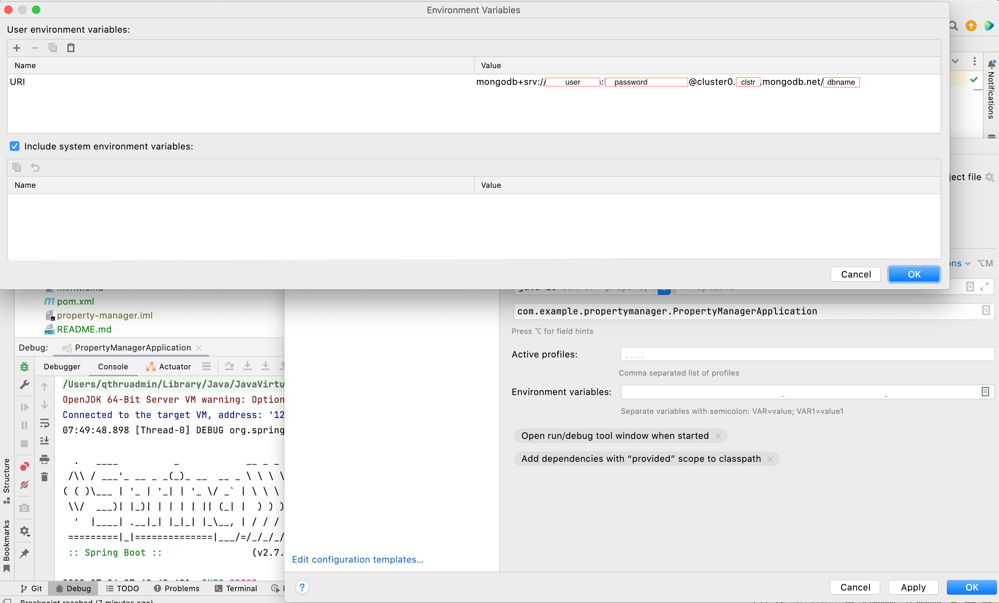

# Property Manager Data Service
The Property Manager Data Service will demonstrate how developers familiar with Spring can interact with MongoDB Atlas without using the Spring Data REST abstraction for MongoDB.  

### Create the DBClient

The first step in interacting with MongoDB is to create the DBClient which will interact with MongoDB Atlas through the MongoClient. This added layer of indirection is a good because it allows us to add additional functionality to the client as we see fit without much refactoring to the classes which depend on it.

* [DBClient](src/main/java/com/example/propertymanager/client/DBClient.java)

## Application Properties

Instead of hard coding strings in our code, we will read them in from environment variables. This will help prevent us from accidentally committing sensitive information to the source code repository and allows us to swap out the values without having to refactor the code. 

* [application.properties](src/main/resources/application.properties)
  * Take special note of the Name/Value pair in the top window
* 